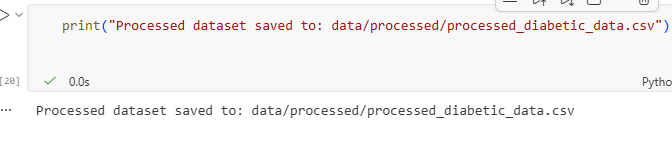
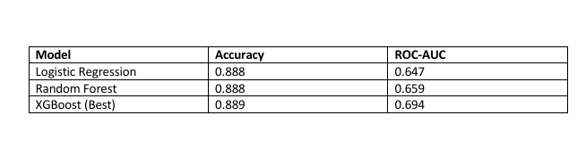
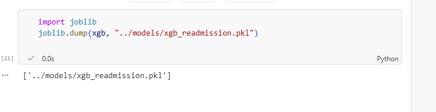

**📝 Project Overview**
This repository contains a complete two‑phase healthcare analytics project combining:

**🔹 Phase 1 — NHS A&E Performance Dashboard (Power BI)**
A full BI solution analysing NHS England A&E performance using official datasets.

**🔹 Phase 2 — Hospital Readmission Prediction (Machine Learning)**
A complete ML pipeline predicting 30‑day readmission for diabetic patients using the UCI Diabetic Readmission dataset.
This project demonstrates:
- Data cleaning & transformation
- DAX & Power BI modelling
- Python‑based ML pipeline
- Feature engineering
- Model evaluation
- Documentation & reproducibility

**📂 Data Sources**
**Phase 1 — NHS A&E Dataset**
- NHS England Monthly A&E Time Series (March 2026 – Revised 14.05.26)
- Source:
https://www.england.nhs.uk/statistics/statistical-work-areas/ae-waiting-times-and-activity/

**Phase 2 — Diabetic Readmission Dataset**
- UCI Machine Learning Repository
- 101,766 hospital encounters
- Target variable: readmitted_30 (1 = readmitted within 30 days)Source:
- Dataset link:
https://archive.ics.uci.edu/dataset/296/diabetes+130-us+hospitals+for+years+1999-2008

**📊 Phase 1 — NHS A&E Performance Dashboard (Power BI)**
The dashboard provides a clear overview of emergency care performance across NHS Integrated Care Boards (ICBs), highlighting operational pressure, patient flow, and performance against the 4‑hour standard.

**⭐ Key KPIs**
- Total Attendances: 2M
- 4‑Hour Performance (All): 0.76
- Total Emergency Admissions: 554K

**⭐ Main Visuals**
- Attendances by ICB
- 4‑Hour Performance by ICB
- Emergency Admissions by ICB
- Geographic performance map
- KPI summary row
- Interactive slicers

### 🏥 A&E Department Types (NHS Standard Classification)

**Type 1 — Major Emergency Departments**
- Consultant‑led, open 24/7
- Full resuscitation facilities
- Treat all emergency conditions
- Example: Large hospital A&E departments

**Type 2 — Single‑Specialty Emergency Departments**
- Consultant‑led but specialty‑specific
- Examples: Eye casualty units, dental emergency units, paediatric emergency units

**Type 3 — Urgent Treatment Centres / Minor Injury Units**
- Non‑consultant led
- Treat minor illnesses and injuries
- Examples: Walk‑in centres, UTCs, community urgent care units

**⭐ Dashboard Screenshots**
 Full Dashboard  

 KPI Row  

 Charts Section  

**⭐ DAX Measures Used**
- Total Attendances = SUM(cleaned_ae_system_level[Total Attendances])
- 4hr Performance (All) = AVERAGE(cleaned_ae_system_level[Perf_4hr_All])
- Total Emergency Admissions = SUM(cleaned_ae_system_level[EA_Total])

**📄 Full A&E Dashboard Report**
Available in /docs  
https://github.com/harimagar/hospital-readmission-ml-and-nhs-ae-dashboard/tree/main/docs

**🤖 Phase 2 — Hospital Readmission ML Model**
**1. Exploratory Data Analysis**
Notebook: 01_data_exploration.ipynb
- Dataset structure
- Missing values
- Target distribution
- Diagnosis code patterns
- Numeric summaries

**2. Preprocessing & Feature Engineering**
Notebook: 02_preprocessing_feature_engineering.ipynb
✔ Missing Value Handling
- Replace '?' with NaN
- Drop high‑missing columns
- Fill categorical missing values with "Unknown"

✔ Target Engineering
- <30 → 1
- NO → 0
- >30 → 0
  
✔ Encoding
- Convert to category dtype
- One‑hot encode
- Clean column names for XGBoost

✔ Scaling
- StandardScaler applied to numeric features

✔ Output
Processed dataset saved to:
- data/processed/processed_diabetic_data.csv

**3. Model Training**
Notebook: 03_model_training.ipynb
Models trained:

Best model saved to:
models/xgb_readmission.pkl

**4. Model Evaluation**
Notebook: 04_evaluation.ipynb
- Confusion Matrix
- Classification Report
- ROC Curve
- Precision‑Recall Curve
- Calibration Curve
- Feature Importance
- Summary Table

**📄 Full ML Model Report**
 https://github.com/harimagar/hospital-readmission-ml-and-nhs-ae-dashboard/tree/main/docs

**🛠 Tools & Technologies**
Power BI
- DAX
- Data modelling
- Visual analytics

Python
- Pandas
- NumPy
- Scikit‑Learn
- XGBoost
- Matplotlib / Seaborn

Other
- Git & GitHub
- Jupyter Notebook
- NHS England Open Data

**📁 Folder Structure**
hospital-readmission-ml-and-nhs-ae-dashboard/
project/
│
├── data/
│   ├── ae_raw/                     # Raw NHS A&E dataset
│   ├── ml_raw/                     # Raw diabetic readmission dataset
│   └── processed/                  # Cleaned & processed datasets
│
├── notebooks/
│   ├── nhs_dashboard/              # Power BI data prep notebooks
│   │   └── 01_data_exploration.ipynb
│   │
│   ├── 01_eda_diabetic.ipynb
│   ├── 02_preprocessing_feature_engineering.ipynb
│   ├── 03_model_training.ipynb
│   └── 04_evaluation.ipynb
│
├── src/
│   ├── ml_preprocessing.py
│   ├── ml_feature_engineering.py
│   ├── ml_models.py
│   └── ml_utils.py
│
├── models/
│   └── xgb_readmission.pkl
│
├── powerbi/
│   ├── hospital_ae_dashboard.pbix
│   └── Screenshot/
│
├── docs/
│   ├── reports/
│   ├── output_screenshot/
│  
│
├── README.md
├── requirements.txt
└── .gitignore

👤 Author
Hari Gharti Magar
MSc Data Science with Advanced Research (UK)

