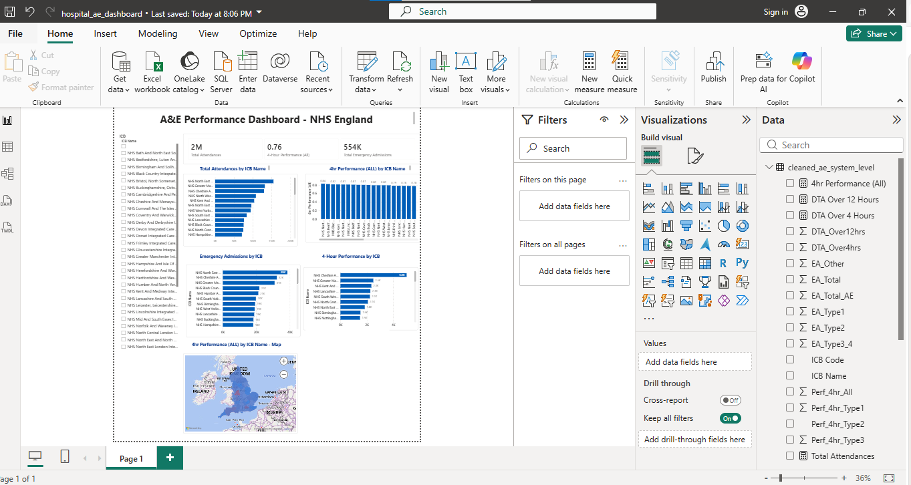
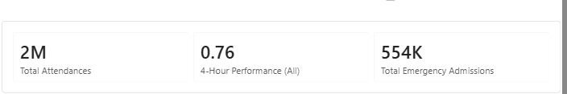
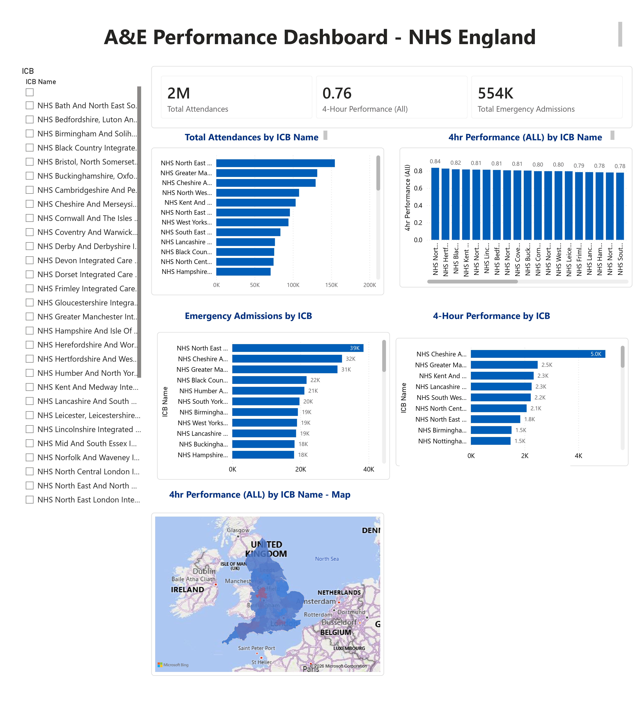

# NHS A&E Performance Dashboard & Hospital Readmission ML Project

## 📝 Project Overview
This repository contains a complete end‑to‑end data analytics and machine learning project combining:

- A Power BI dashboard analysing NHS England A&E performance (Phase 1)
- A Machine Learning model predicting hospital readmission risk using the UCI Diabetic Readmission dataset (Phase 2)

The project demonstrates strong skills in data cleaning, DAX, visual analytics, Python, ML modelling, and documentation — suitable for NHS data roles, analytics positions, and academic research portfolios.

---

### 📂 Data Source
Official NHS England dataset:
Monthly A&E Time Series — March 2026 (Revised 14.05.26)
Source: NHS England, A&E Attendances and Emergency Admissions
https://www.england.nhs.uk/statistics/statistical-work-areas/ae-waiting-times-and-activity/

## 📄 A&E Performance Dashboard Report
This project includes a full professional report documenting the A&E Performance Dashboard built using NHS England’s Monthly A&E dataset (March 2026 – Revised 14.05.26).

You can view the report here:
https://github.com/harimagar/hospital-readmission-ml-and-nhs-ae-dashboard/tree/main/docs

## 📊 Phase 1 — A&E Performance Dashboard (Power BI)

The dashboard provides a clear overview of emergency care performance across NHS Integrated Care Boards (ICBs).  
It highlights operational pressure, patient flow, and performance against the 4‑hour standard.

### **Key KPIs**
- **Total Attendances:** 2M  
- **4‑Hour Performance (All):** 0.76  
- **Total Emergency Admissions:** 554K  

### **Main Visuals**
- Total Attendances by ICB  
- 4‑Hour Performance by ICB  
- Emergency Admissions by ICB  
- Geographic performance map  
- ICB slicer for interactive filtering  

### **Screenshots**
#### Full Dashboard  

#### KPI Row  

#### Charts Section  

## 🧮 DAX Measures Used

Total Attendances = SUM(cleaned_ae_system_level[Total Attendances])

4hr Performance (All) = AVERAGE(cleaned_ae_system_level[Perf_4hr_All])

Total Emergency Admissions = SUM(cleaned_ae_system_level[EA_Total])

---

## 📁 Folder Structure

hospital-readmission-ml-and-nhs-ae-dashboard/
│
├── data/                     # Raw and cleaned datasets
├── docs/                     # Documentation reports
├── notebooks/                # Jupyter notebooks (ML)
├── powerbi/
│   ├── A&E_Dashboard.pbix
│   └── screenshots/
│       ├── dashboard_full.png
│       ├── kpi_row.png
│       └── charts_section.png
├── src/                      # Python scripts for ML pipeline
├── README.md
└── LICENSE

---

## 🛠 Tools & Technologies

- **Power BI** (DAX, data modelling, visualisation)  
- **Python** (Pandas, NumPy, Scikit‑Learn, Matplotlib, Seaborn)  
- **Jupyter Notebook**  
- **Git & GitHub**  
- **NHS England Open Data**  

---

## 🔥 Phase 2 — Hospital Readmission ML Model (Coming Next)

Phase 2 will include:

- Data cleaning & preprocessing  
- Exploratory Data Analysis (EDA)  
- Feature engineering  
- Model training (Logistic Regression, Random Forest, XGBoost)  
- ROC‑AUC evaluation  
- Feature importance  
- Model saving & deployment-ready structure  

This will turn the project into a complete **end‑to‑end analytics + ML pipeline**.

---

## 📌 Author  
Hari — MSc Data Science with Advance Research (UK)  
NHS Data & Analytics Portfolio Project  
